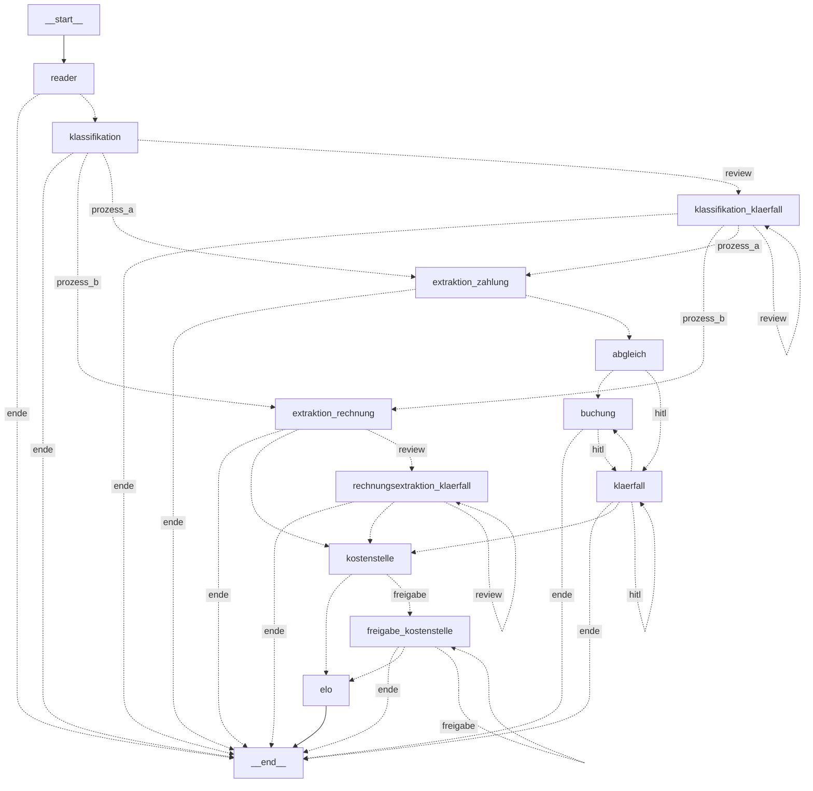
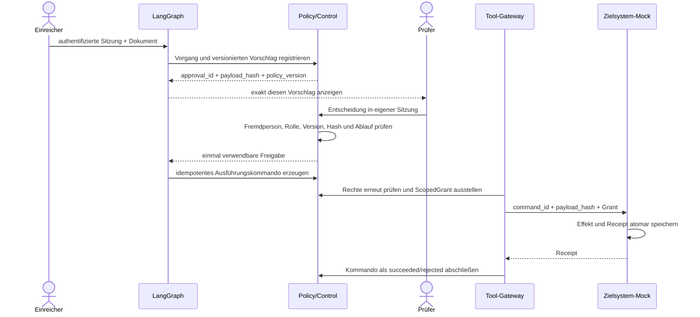

# Architektur des kontrollierten Prototyps

Stand: 21. September 2026

## Schichten und Verantwortungen

| Schicht | Komponenten | Verbindliche Aufgabe |
|---|---|---|
| Identität und Zugriff | `governance/identity.py`, `governance/ad.py` | Admin-Passwortmodus oder begrenzte Demositzung; kurzlebige Sitzung, Benutzer- und Gruppenprüfung |
| Orchestrierung | `graph/workflow.py`, `graph/nodes/` | Prozessfolge, Unterbrechung und Fortsetzung; keine Berechtigungsquelle |
| Policy und Governance | `governance/step_policy.py`, `governance/policy.py`, `governance/control.py` | geschlossene Schrittmatrix, Freigabevertrag, aktive Rechteprüfung, Stop/Fortsetzen |
| Tool-Gateway | `runtime/tool_gateway.py` | lokaler Endpunkt, ScopedGrant, Payload-Hash, Kommandozustand |
| Zielsystem | `runtime/targets.py`, `mocks/` | atomarer Effekt, dauerhafter Receipt, Zielsystem-Audit |
| Audit und Monitoring | `governance/audit.py`, `governance/audit_contract.py` | kompatibler Legacy-Hashverbund und sieben Kategorien in `audit_v2` |
| Daten und Migration | `data/migrations.py`, `data/control_schema.sql` | additive, versionierte Kontrolltabellen |
| Präsentation | `ui/`, `demo.py` | Anmeldung, Vorgangsdarstellung und Eingaben; keine alleinige Policy-Entscheidung |

LangGraph hält den Ablaufzustand und die Position eines unterbrochenen
Vorgangs. Der verbindliche Kontrollzustand liegt in den Tabellen
`controlled_cases`, `case_candidates`, `approvals`, `execution_commands` und
`scoped_grants`. Dadurch kann ein alter oder veränderter Checkpoint keine
Schreibberechtigung erzeugen.

Der Portalmodus betrifft ausschließlich die Erzeugung der menschlichen
Sitzung. `admin` verlangt ein Passwort und installiert einmalig das
dokumentierte lokale Administratorkonto. `demo` erlaubt ohne Passwort nur die
konfigurierten synthetischen Einreicher- und Prüferidentitäten. Hinter dieser
Grenze laufen beide Modi durch dieselben Kontrolltabellen und Policyprüfungen.

## Prozessgraph

## Kontrollierter Schreibpfad

Bei einem Transportfehler wird das Kommando `in_doubt`. Ein Prüfer kann es
über die Bedienoberfläche anhand des eigenen, zum Kommando gehörenden Receipts
wiederaufnehmen. Fremde oder lediglich zufällig passende Zielsystemzustände
gelten nicht als Beleg.

## Prozess A – Zahlungsbestätigung

1. Der Reader prüft die authentifizierte Identität und das Einspeiserecht,
   liest das PDF und registriert Hash sowie unveränderte Bytes.
2. Klassifikation und Extraktion laufen lokal.
3. Der deterministische Abgleich prüft Rechnungsnummer, offenen Status und
   centgenauen Betrag.
4. Jede Buchung wird als versionierter Vorschlag dargestellt. Korrekturen
   erzeugen eine neue Version und damit eine neue Freigabe.
5. Eine andere berechtigte Person bestätigt. Vor dem Senden werden deren
   Rechte und die Rechte des Einreichers erneut geprüft.
6. Navision ändert genau einen offenen Posten atomar zu `bezahlt` und liefert
   einen Receipt mit Vorher-/Nachher-Zustand.

## Prozess B – Eingangsrechnung

1. Reader, Klassifikation und Extraktion folgen demselben lokalen Eintrittspfad.
2. Die Kostenstelle wird ausschließlich über eine exakte Referenz ermittelt.
3. Fehlt eine eindeutige Referenz, wählt eine andere berechtigte Person aus dem
   aktuellen Katalog; die geänderte Auswahl muss als neuer Vorschlag erneut
   bestätigt werden.
4. ELO speichert den logischen Archiveintrag mit dem bereits unveränderlich
   registrierten Original und der aktiven Kostenstellenzuordnung.
5. Eine Korrektur deaktiviert die bisher aktive Zuordnung und ergänzt eine
   neue Version. Original und Historie bleiben erhalten.

Prozess B endet in ELO und schreibt nicht in Navision. Prozess A endet in
Navision und archiviert nicht in ELO.

## Modell- und Datenfluss

`governance/inference_policy.py` akzeptiert für Standardverarbeitung nur den
registrierten lokalen Ollama-Endpunkt. Ein Providerprofil oder eine
Oberflächeneinstellung kann diese Laufzeitregel nicht aufheben.

`llm/layout.py` stellt einen separaten Ausnahmeweg bereit. Er setzt einen
gespeicherten lokalen Extraktionsfehler voraus, erzeugt aus genau einer
Seitenregion ein gerastertes PNG und verlangt eine menschliche
Maskierungsbestätigung. Erst wenn zusätzlich aktuelle Nachweisdateien für
Region, Auftragsverarbeitung, Löschfristen, kein Training und den freigegebenen
internen Proxy vorliegen, wird der Bildausschnitt übertragen. Der normale
Dokumenttext und das vollständige PDF sind kein Bestandteil dieses Payloads.

## Persistenz

Die Migrationen sind additiv. `data/schema.sql` bleibt die Basisschicht;
`data/control_schema.sql` ergänzt die Kontrolltabellen und wird über
`data/migrations.py` genau einmal pro Version angewendet. Unveränderliche
Dokumentobjekte und `audit_v2` werden zusätzlich durch SQLite-Trigger gegen
Änderung und Löschung geschützt.

Geldbeträge werden an der Kommandogrenze als ganzzahlige Centwerte validiert.
Gleitkommazahlen sind ausschließlich Darstellungs- und Eingabeformat; Werte,
die nicht positiv, endlich oder centgenau sind, werden abgewiesen.
