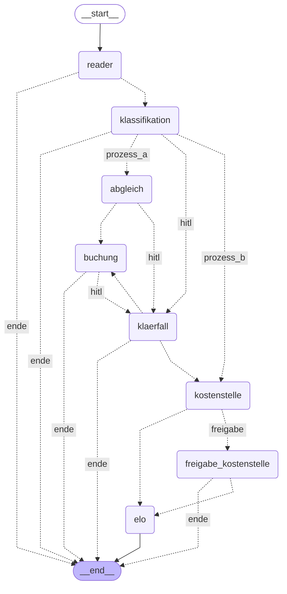

# Prototype architecture

## Overview

The prototype implements a multi-agent system for two of CHG-MERIDIAN's
internal financial processes. Both processes run through **one shared
LangGraph graph** with shared components (reader, orchestrator,
classification, data layer). Processing is separated into layers whose
boundaries are enforced in code.

```
Intake (PDF + submitter UPN)
        │
        ▼
   [Reader tool]  ── AD check (Least Privilege) ──► denied → end + audit
        │  PDF → Markdown (deterministic, not an AI agent)
        ▼
   [Classification & extraction]  ── LLM, validated
        │
        │  extraction failed (R1 escalation) ──► exception case (HITL), see
        │  Process A below -- classification could not determine a type
        ▼
   [Orchestrator]  ── conditional edge on document type
        ├──► Process A (Zahlungsbestätigung), below
        └──► Process B (Eingangsrechnung), below

   Process A -- Zahlungsbestätigung
   ─────────────────────────────────
        │
        ▼
   [Reconciliation] (level 1, deterministic)
        │  Number present?
        │    no  ──► exception case (HITL), below
        ▼  yes
   [Booking] (level 3)  ── requests approval, always (Thesis §7.4, table 11)
        │
        ▼
   exception case (HITL)  ── reached either from Reconciliation (a problem
   was found) or from Booking (approval is always required); a person
   decides either way. (A guard also routes from here to process B's
   cost-center step if a failed classification ever left an incoming
   invoice's type in place -- not a live path today, see
   route_exception_case in graph/nodes/payment_confirmation.py.)
        │  rejected ──► end (rejected)
        ▼  approved
   [Booking] (level 3)  ── second pass: this time it actually books
        │
        ▼
   Navision /booking (open→paid)  ── end of process A

   Process B -- Eingangsrechnung
   ──────────────────────────────
        │
        ▼
   [Cost center] (level 2, deterministic)
        │  Reference unique?
        │    no  ──► four-eyes approval (HITL): a person decides
        │              rejected ──► end (rejected)
        │              approved  ──► [ELO], below
        ▼  yes
   [ELO] (level 3)
        │
        ▼
   ELO /archive  ── end of process B (no booking here)

   Cross-cutting: [Policy] (deterministic) · [Audit] (hash-chained, read-only)
```

> **Process B ends at ELO** (diagram part 3): tamper-evident archiving is
> the end of the process, there is no Navision booking in process B.
> Navision is only addressed in process A. Cost center and ELO are
> human-on-the-loop -- the four-eyes approval only kicks in when the
> cost-center reference is missing.
>
> **Two deterministic domain agents:** reconciliation (process A, invoice
> number) and cost center (process B, cost-center reference) are exact
> referential lookups without a language model (Thesis §7.4). Extracting
> the number or reference itself is done by the classification agent (with
> a model).
>
> **Booking agent always human-in-the-loop:** the financially effective
> booking step (process A) requires a human approval for every booking --
> no amount threshold (Thesis §7.4, table 11).

## Layers and their boundaries

| Layer | Directory | LLM? | Boundary |
|---|---|---|---|
| Configuration | `agent_registry.py`, `config.py` | no | read by governance |
| Governance | `governance/` | **no, enforced** | imports no higher layer, no LLM |
| Tools | `tools/`, `llm/` | LLM encapsulated | AD check as entry condition |
| Agents | `agents/` | some | call governance + LLM + mocks |
| Orchestration | `graph/`, `graph/nodes/` | no | wires up agents, sets HITL interrupts |
| Target systems | `mocks/` | no | check their own preconditions |

The most important boundary is that of the **governance layer**:
`governance/policy.py`, `ad.py`, and `audit.py` import no LLM client and
nothing from `agents/`. This is not a style principle but the thesis's
central technical claim, and it is enforced via an AST test
(`tests/test_layer_boundaries.py`). The practical evidence: every governance
decision is deterministic and reproducibly verifiable with a unit test --
with a language model, it would not be.

## Separating process A from process B within the shared graph

The "one shared graph" claim above is about the *runtime*: there is one
compiled `StateGraph`, one checkpointer, one database. It says nothing
about how the source files that build that graph are organized -- and
until this rework, they were not organized by process at all:
`graph/workflow.py` defined every node of both processes back to back, and
`agents/` mixed A's and B's modules flat. That made the two processes hard
to tell apart while reading the code, even though they are cleanly
separate at the concept level (Zahlungsbestätigung and Eingangsrechnung
never share a node beyond the intake stretch).

The fix is a rule, not a diagram: **`process_registry.py` says *what* a
process is; every other layer keeps a same-named place for *its own*
slice of it.**

```
process_registry.py                # "A" and "B": name, route, steps, interrupt kind
agents/shared/                      # genuinely shared: classification, extraction schemas
agents/payment_confirmation/        # A's agents only: reconciliation, booking
agents/incoming_invoice/            # B's agents only: cost center, archiving
graph/nodes/payment_confirmation.py # A's nodes only (+ its exception-case HITL)
graph/nodes/incoming_invoice.py     # B's nodes only (+ its four-eyes approval)
ui/cases/process_views/payment_confirmation.py  # A's outcome texts, approval input, metric
ui/cases/process_views/incoming_invoice.py      # B's outcome texts, approval input, metric
```

`agents/shared/classification.py` and the reader (`tools/`) stay outside
either process folder, because both processes genuinely share them --
moving them into either process folder would misrepresent that. `graph/workflow.py` and
`ui/cases/detail.py` shrink to pure wiring: the first imports the three
node modules and calls `add_node`/`add_conditional_edges`, qualifying every
reference (`payment_confirmation.node_booking`, not a bare `node_booking`)
so which process a node belongs to is visible at the call site; the second
renders the shared shell (stepper, header, document preview) and asks
`ui/cases/process_views` for whatever differs by process, resolved by
**interrupt kind**, not by process key -- a case that reaches process A's
exception-case node via a failed classification has no resolved process
yet, but the interrupt kind is always known.

Two node names live in different namespaces on purpose and were not
touched by this rework: the graph node `freigabe_kostenstelle` logs its
steps under `"freigabe"` (the label `process_registry.ProcessStep` and the
stepper use). Harmonizing the two would be a cosmetic change with a real
cost: it touches persisted run logs and the stepper's lookup.

The separation is enforced, not just described: `tests/test_process_separation.py`
statically checks (the same AST technique as `tests/test_layer_boundaries.py`,
one level down) that process A's node module never imports process B's
agents and vice versa, and that the shared wiring files
(`graph/workflow.py`, `ui/cases/detail.py`) import no agent module at all.
Without that test, this section would be a claim about the file layout that
the next edit could quietly undo.

## Generated flow diagram

The ASCII diagram above is drawn by hand for readability: German labels,
execution order, and it renders in any plain-text viewer. The diagram below
is generated from the compiled graph itself
(`build_graph().compile().get_graph().draw_mermaid()`) and is exact where
the hand-drawn one is approximate: technical node names, every conditional
edge and its routing label, nothing rounded off for readability. Both
describe the same graph on purpose -- the hand-drawn one explains it, this
one is evidence.

Also saved as [`docs/flow.mmd`](flow.mmd), which carries the regeneration
command in its header comment. `tests/test_flow.py` compares the edges of
both this copy and `docs/flow.mmd` against the compiled graph on every test
run, so a change to `graph/workflow.py` that leaves either copy stale fails
the suite instead of silently drifting.



## Three "outcome" vocabularies

Three different things are called "outcome" in this codebase, read by
different code for different reasons. Keeping the names apart
(`CaseOutcome` vs. `governance.policy.Outcome` vs. the audit column) is
deliberate -- see `CaseOutcome`'s docstring in `contracts.py` -- but the
shared English word is itself one of the comprehension hurdles this
rework set out to fix, so here they are side by side:

| Vocabulary | Defined in | Answers | Example values |
|---|---|---|---|
| `governance.policy.Outcome` | `governance/policy.py` | May this one write action proceed right now? -- the verdict of a single policy check, imported by name in `agents/payment_confirmation/booking.py` and `agents/incoming_invoice/archiving.py` | `erlaubt`, `freigabe_noetig`, `verweigert` |
| `CaseOutcome` | `contracts.py` | How did the whole case end? -- `state["outcome"]`, written once, by whichever node completes the case | `verbucht`, `archiviert`, `verworfen`, `zugriff_verweigert`, `abgelehnt`, `archivierung_fehlgeschlagen` |
| Audit column `outcome` | `governance/audit.py` (schema) | What should this one log entry say happened? -- not a closed vocabulary of its own; callers pass whichever value fits: a `governance.policy.Outcome`, a `CaseOutcome`, an `ApprovalDecision`, or a raw agent-level `Finding` | `erlaubt`, `freigabe_noetig`, `freigegeben`, `verworfen`, `ok`, `betrag_abweichend`, `eindeutig`, … |

`CaseOutcome` and `governance.policy.Outcome` share no German string values
with each other -- the collision between them is in code (both would
naturally be called `Outcome`), not in data.
`tests/test_contracts.py::test_process_outcomes_use_the_declared_vocabulary`
pins that every process's `completion_outcome` is a real `CaseOutcome`
value. The audit column has no such closed set to pin against: it is a
union by design, because an audit trail records what a specific agent
decided, in that agent's own vocabulary, not a single system-wide state
machine.

## Why LangGraph

The graph-based approach with explicit state and a checkpointer maps three
of the thesis's requirements directly:

- **Human-in-the-loop:** `interrupt()` pauses the case at a risk point; the
  checkpointer persists the state, and a human later resumes it via
  `Command(resume=...)`. No HITL without a checkpointer -- the checkpointer
  is therefore not optional (`graph/workflow.py::compile_graph`).
- **Risk-based approval points:** modeled as conditional edges whose
  condition comes from the agent registry's oversight mode -- the booking
  agent's standing human-in-the-loop mode, or an escalation out of
  human-on-the-loop when an agent cannot decide (four-eyes principle).
  Which of the two stopped a case is declared in the interrupt payload
  (`contracts.ApprovalTrigger`) and named to the approver in the approval
  dialog; it is never inferred from the finding.
- **Audit trail:** every node writes hash-chained into the trail; the graph
  state keeps a run log for the UI and CLI.

Stack validation (as of 2026-07-17): LangGraph 1.2.9 confirmed; PyMuPDF4LLM
instead of Docling as the default, because the synthetic PDFs are native
and Docling would load 1-2 GB of model weights for no added value (Docling
remains selectable via `READER_PARSER=docling`). Details in
[mapping.md](mapping.md).

## Model provisioning

The model choice follows from two inputs: an agent's **risk class**
(`agent_registry.py`, `ModelClass`) and the **deployment mode** (`.env`,
`MODEL_MODE`). `llm/client.py::choose_model` combines both:

| Mode | reading/uncritical roles | risk-bearing roles |
|---|---|---|
| `lokal` | Ollama | Ollama |
| `hybrid` | Ollama (data sovereignty) | Anthropic (frontier) |
| `cloud` | Anthropic | Anthropic |

No agent knows its provider -- that is the point of the abstraction and the
technical basis for the thesis's sub-question 2 (cloud vs. open-source by
risk class). The prototype loads no models itself; it connects to an Ollama
instance (`OLLAMA_BASE_URL`) whose models are provisioned outside it.
`demo.py --check` checks the provisioning.

## Data flow and persistence

A shared SQLite database (`data/stammdaten.db`) holds master data, the AD
mock, target-system state, and the audit trail -- deliberately a single
file, because the thesis argues from a *shared* data layer. The LangGraph
checkpointer uses a separate file (`data/checkpoints.sqlite`).

## Model IDs (as of 2026-07-17, change quarterly)

| Role | local (Ollama) | Cloud (Anthropic) | Cloud price (in/out per 1M) |
|---|---|---|---|
| reading/small | `qwen3:8b` | `claude-haiku-4-5` | $1 / $5 |
| classification (vision) | `qwen2.5vl:7b`¹ | `claude-opus-4-8` | $5 / $25 |
| critical writing | — | `claude-opus-4-8` | $5 / $25 |

¹ The functional concept originally named `llama3.2-vision:11b`; it failed
to load under Ollama in this project's own testing ("unknown model
architecture: mllama"). `qwen2.5vl:7b` is confirmed working and is the
default in `.env.example`/`config.py`.
